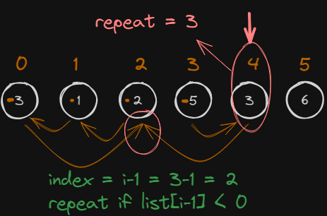

# [Find the Duplicate Number](https://leetcode.com/problems/find-the-duplicate-number/) (and Missing)
Дан массив целых чисел геометрической прогрессии в диапазон `[1, n]`. Но в массиве одно повторяется т.е. заменено другим из массива. Нужно найти повторяющиеся и замененное число.
```
Example 1:
Input: nums = [1,3,4,2,2]
Output: (2, 5)

Example 2:
Input: nums = [3,1,3,4,2]
Output: (3, 5)
```
# Идея
Проходим по входящему массиву, и меняем знак у числа под индексом (итерируемого числа - 1). Перед этим проверяем, что знак положительный. Если встретили отрицательный, значит мы сюда уже заходили, а это означает что мы нашли повторяющиеся число.



# Решение поиска повторяющегося числа
1. Проходим по массиву чисел указателем
2. Берем число под указателем в качестве индекса и меняем в этом же массиве у числа под этим индексом, знак на отрицательное
3. Когда мы встретим отрицательное число под указателем, это будет означать, что мы нашли повторяющиеся число
4. Если не нужно находить заменённое число, то останавливаем цикл

# Решение поиска пропущенного числа
1. Генерируем циклом геометрическую прогрессию
2. Итерируемое число прогрессии берем, как индекс и смотрим какое число под индексом во входящем массиве
3. Т.к. индексация с нуля, то надо вычесть единицу из числа прогрессии
4. Т.к. в массиве все числа стали отрицательными, кроме одного, то найдя положительное число, можем понять, какое пропущено итерируемому числу прогрессии

# Нюансы
1. В задаче может стоять условие, что массив нельзя изменять
2. Когда берем число входящего массива и смотрим другое число под этим индексом, нужно применять функцию abs. Потому что там могут быть отрицательные числа.

# Решение
```python
def search_dublicate_and_missing(nums):
	repeat = None
	for i in range(len(nums)):
		n = abs(nums[i])
		check_num_with_index = n - 1
		check_num = nums[check_num_with_index]
		
		if check_num < 0:
			repeat = check_num
			# Можно выйти из функции, если не надо искать замененное число.
		else:
			nums[check_num_with_index] = -check_num

	# Поиска замененного числа.
	# Во входящем массиве все числа стали отрицательные, кроме одного.
	# Генерируем числа геометрической прогрессии.
	# Ищем положительное число.
	missing = None
	for i in range(len(nums)):
		
		if nums[i] > 0:
			# Индекс с нуля, поэтому добавим nums[i] + 1, 
			# чтоб получить число прогрессии.
			missing = nums[i] + 1

	return repeat, missing
```

# Сложность по скорости
O(n), в худшем случае пройдемся всем элементам массива два раза O(2n).

# Сложность по памяти
O(1), Память постоянна, не зависит от входящего массива.
