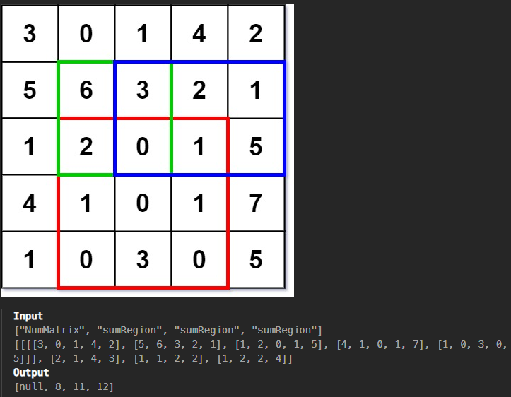

# [Range Sum Query 2D - Immutable](https://leetcode.com/problems/range-sum-query-2d-immutable/)

Вывести смму элементов окна матрицы за O(1)



Идея: Создать префиксную матрицу сумму чисел элементов сверху

Решение:
1. Создать префиксную матрицу, дополнительно нули слева и вверху матрицы, чтобы не возникали пограничные случаи
2. Проходя по матрице, суммировать числа сверху текущей ячейки, значение записывать в префиксную матрицу
3. Как найти сумму требуемого окна
4. Надо взять сумму нижнего края из префиксного массива и вычесть сумму выше верхнего края, все это из префиксного массива

```python
class NumMatrix:

    def __init__(self, matrix: List[List[int]]):
        self.matrix = matrix

        # Создание префиксного массива. Число в ячейке, это число ячейки плюс сумма всех сверху
        cols = len(matrix[0])
        rows = len(matrix)
        self.prefix_matrix = [
	        [0 for col in range(cols+1)] 
	        for row in range(rows+1)
	    ]

        for row in range(1, rows+1):
            for col in range(1, cols+1):
                current_value = matrix[row-1][col-1]
                up_sum = self.prefix_matrix[row-1][col]
                self.prefix_matrix[row][col] = current_value + up_sum

    def sumRegion(self, row1: int, col1: int, row2: int, col2: int) -> int:
        col2 += 1 # когда берем срез, надо увеличить на 1
        # В префисном массиве сдвиг на +1
        col2 += 1 
        col1 += 1
        row1 += 1
        row2 += 1
        return (
            sum(self.prefix_matrix[row2][col1:col2]) 
            - sum(self.prefix_matrix[row1-1][col1:col2])
            )
```
Нюансы:
- Окно массива, которое нужно просуммировать т.к. я беру срез в Python, надо увеличивать на 1

Оценка `sumRegion`:  `Time O(col2-col1), Mem O(1)`
