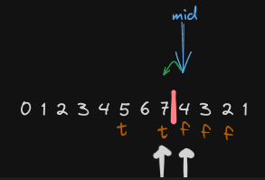

# [Peak Index in a Mountain Array](https://leetcode.com/problems/peak-index-in-a-mountain-array/)
Эта задача решается точно таким же решением:
https://leetcode.com/problems/find-peak-element/description/

## Задача
Массив arr является горой, начальный элемент всегда меньше последующего, а последний всегда меньше предыдущего. Во входном массиве не менее 3 элементов.
```
Пример 1:
Входные данные: arr = [0,1,0]
Результат: 1

Пример 2:
Входные данные: arr = [0,2,1,0]
Результат: 1

Пример 3:
Входные данные: arr = [0,10,5,2]
Результат: 1
```
## Идея
Сравнивать предыдущий с текущим элементов
## Решение
- Сравнивать предыдущий с текущим элементов
- Если текущий больше, значит двигаем левый указатель
- Если меньше, правый указатель
- Левый указатель будет ответом



```python
class Solution:
    def findPeakElement(self, arr: List[int]) -> int:
        l, r = 0, len(arr)

        check = lambda mid: arr[mid-1] < arr[mid]

        while r - l > 1:
            mid = (l + r) // 2

            if check(mid):
                l = mid
            else:
                r = mid
            
        return l
```
Оценка по памяти `O(1)`

Оценка по времени `O(log n)`
