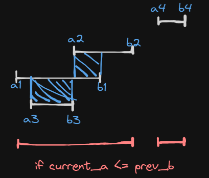

# [Merge Intervals](https://leetcode.com/problems/merge-intervals/)
Соединить перекрывающиеся отрезки


Решение:
1. Отсортировать массив по началам интервалов
2. Создать массив `result`, в котором будут объединенные интервалы
3. Добавить туда первый интервал
5. Запустить цикл по интервалам со второго интервала
6. Сравнивать текущий и предыдущий
7. Если начало текущего меньше или равно концу предыдущему, значит они пересекаются, их нужно объединить
8. Для этого сдвигается конец и начало интервала до мин и макс текущего и последнего в `result`
9. Иначе добавить добавить `a` и `b` текущего в `result`

```python
class Solution:
    def merge(self, intervals: List[List[int]]) -> List[List[int]]:
        intervals.sort(key=lambda i: i[0])
        result = [intervals[0]]

        for i in range(1, len(intervals)):
            a, b = intervals[i]
            prev_a, prev_b = result[-1][0], result[-1][1]

            if a <= prev_b:
                result[-1][0] = min(prev_a, a)
                result[-1][1] = max(prev_b, b)
            else:
                result.append([a, b])

        return result
```
Оценка по памяти O(n log n), из-за сортировки.

Оценка по памяти O(n), для сортиовки и нового массива результата.
