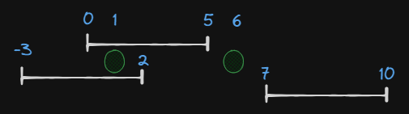

# [Точки и отрезки](https://informatics.msk.ru/mod/statements/view.php?chapterid=112542#1)

## Задача
Определить на скольких отрезках лежит точка.
```
lines = [0, 5], [-3, 2], [7, 10]  
points = [1, 6]

Result: [2, 0]
```

## Идея
Использовать метод точек. Завести счетчик и по точкам начал увеличивать, а по точкам концов уменьшать счетчик. При встрече точки, текущий счетчик будет говорить о кол-во отрезков, которым принадлежит точка.
## Решение
- Создать массив для подсчета точек, длинной: `len(lines) * 2 + len(points)`
- Пройтись по массиву отрезков и добавлять в массив подсчета точек, точки начала с флагом 1 `({start}, 1)` и точки концов с флагом -1 `({end}, -1)`
- Пройтись по массиву входящих точек и добавить в массив подсчета точек значения с флагом 0 и индексом расположения в массиве `({point}, -1, i)`, чтобы потом правильно расположить в массиве ответа.
- Отсортировать массив с точками подсчета по ключу (x[0], -x[1]), второе нужно для того, чтобы одинаковые значения точек отрезков и входящих точек стояли сначала точки отрезков, а потом входящие точки.
- Создать массив результата длинной массива входящих точек `len(points)` или его же использовать 
- В цикле пройтись по массиву подсчета и просуммировать значения флагов в i[1]
- Поставить условие, что если i[1] элемент равен 0, значит мы встретили проверочную точку, занести текущую сумму в массив результата под индексом i[2]
- Вернуть массив результата
```python
def count_lines_by_points(lines, points):  
    # Массив точек должен быть в 2 раза длинее + места для точек равное их кол-ву.  
    count_points = [0] * (len(lines) * 2 + len(points))  
    for i in range(len(lines)):  
        ii = i * 2  
        count_points[ii] = (lines[i][0], 1)  
        count_points[ii+1] = (lines[i][1], -1)  
  
    for i in range(len(points)):  
        count_points[len(lines) * 2 + i] = (points[i], 0, i)  
  
    count_points.sort(key=lambda x: (x[0], -x[1]))  
  
    summ = 0  
    for p in count_points:  
        if p[1] == 0:  
            points[p[2]] = summ  
        else:  
            summ += p[1]  
  
    return points
```
Оценка по памяти `O(n+m)`, из-за сортировки и массива с точками и флагами

Оценка по времени `O(n log n)` из-за сортировки, без неё `O(n)`