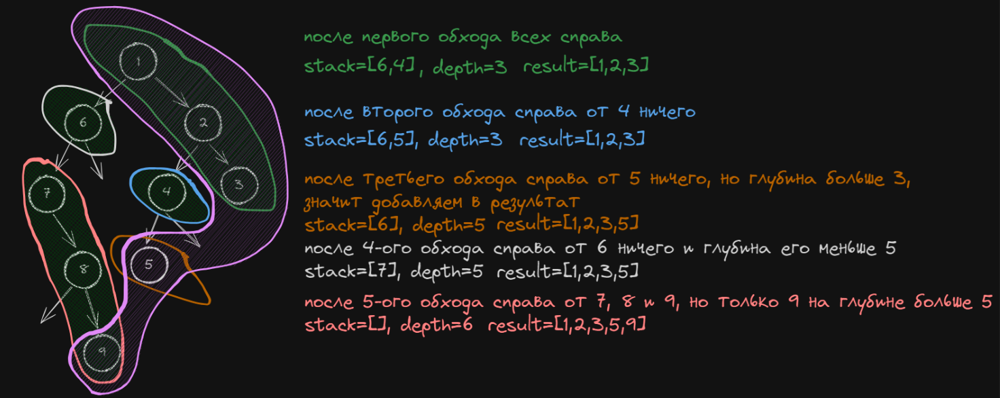

# [Binary Tree Right Side View](https://leetcode.com/problems/binary-tree-right-side-view/)

## Задача
Учитывая `root` вид двоичного дерева, представьте, что вы стоите на **правой стороне** него, верните _значения узлов, которые вы можете видеть, упорядоченные сверху вниз_.
```
Входные данные: root = [1,2,3, null, 5, null, 4]
Вывод: [1,3,4]

Пример 2:
Входные данные: root = [1, null,3]
Вывод: [1,3]

Пример 3:
Ввод: root = []
Вывод: []
```

## Идея
Использовать переменную для запоминания максимальной глубины обхода дерева в которой был последний раз добавлен узел справа
Также в стек добавлять узлы, сначала слева, потом справа. Для обработки брать узел сначала справа
Добавлять в стек узел со значением глубины, на которой он находится

## Нюансы
- Проверять, что узел не None

## Решение
1. Создаем стек для хранения узлов, которые нужно обойти
2. Создаем переменную текущей глубины обхода дерева
3. Обходим узлы, узлы слева, потом справа добавляем в стек со значением глубины
4. Значение текущего узла добавляем в результат, если его глубина больше максимальной глубины



```python
from collections import deque

# Definition for a binary tree node.
# class TreeNode:
#     def __init__(self, val=0, left=None, right=None):
#         self.val = val
#         self.left = left
#         self.right = right

class Solution:
    def rightSideView(self, root: Optional[TreeNode]) -> List[int]:
        stack = deque([(1, root)])
        values = []
        max_depth = 0

        while stack:
            node_depth, node = stack.pop()

            if not node:
                continue

            if node_depth > max_depth:
                values.append(node.val)
                max_depth = node_depth

            stack.append((node_depth + 1, node.left))
            stack.append((node_depth + 1, node.right))

        return values
```
Оценка по памяти `O(h + (n log n))`, h это глубина дерева, массив со значениями будет равен глубине дерева. Также еще стек будет хранить данные, но максимально кол-во значений будет равно логарифму `O(n log n)`

Оценка по времени `O(n)`, здесь поиск в ширину, будет обход всего дерева.
