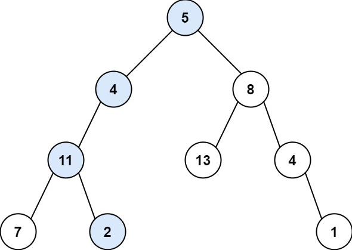

# [Path Sum](https://leetcode.com/problems/path-sum/)
## Задача
Учитывая root двоичное дерево и целое число targetSum, верните true, 
если у дерева есть путь от корня к листу, такой, 
что суммирование всех значений вдоль пути равно targetSum.

Лист - это узел, не имеющий дочерних элементов.
```
Входные данные: root = [5,4,8,11, null, 13,4,7,2, null, null, null, 1], 
целевая сумма = 22 
Вывод:true 
Объяснение: Показан путь от корня к концу с целевой суммой.
```

## Идея
Проходимся в ширину по всему дереву. Использовать стек, чтоб обойти все дерево. В стек узлов складывать дополнительно глубину на которой он лежит. И еще один стек в которой складывать значения текущих узлов и глубины узла, по которому идет обход и если у текущего узла нет дочерних, суммируем стек и проверяем на равенство. При обходе следующего узла, из стека значений надо удалить все значения с глубиной равной и больше текущей глубины узла.
## Решение  
- Создаем стек для хранения узлов, которые нужно обойти  
- Добавить в стек обхода дерева корневой узел  
- Создаем стек для хранения узлов ветки, которые нужно просуммировать  
- Обходим дерево циклом, проверять, что узел не None 
- Из стека удалить все значения, глубина которых больше или равна глубине текущего узла
- Добавить значение текущего узла в стек ветки
- Если у узла нет дочерних узлов, проверить сумму ветки
- Добавить дочерние узлы в стек обхода со значениями глубины
```python
from collections import deque

# Definition for a binary tree node.
# class TreeNode:
#     def __init__(self, val=0, left=None, right=None):
#         self.val = val
#         self.left = left
#         self.right = right

class Solution:
    def hasPathSum(self, root: Optional[TreeNode], targetSum: int) -> bool:
        stack = deque([(1, root)])
        branch = deque()

        while stack:
            level, node = stack.pop()

            if node:
                while branch:
                    if branch[-1][0] >= level:
                         branch.pop()
                    else:
                        break

                branch.append((level, node.val))

                if not node.left and not node.right:
                    if sum([x[1] for x in branch]) == targetSum:
                        return True
                else:
                    stack.append((level + 1, node.right)) if node.right else None
                    stack.append((level + 1, node.left)) if node.left else None
        
        return False
```
Оценка по памяти `O(h + (n log n))`, где h это глубина дерева, столько памяти нужно для хранения стека значений узлов и `(n log n)` для стека узлов для обхода дерева.

Оценка по времени `O(n)`, поиск в ширину, обход всего дерева.
