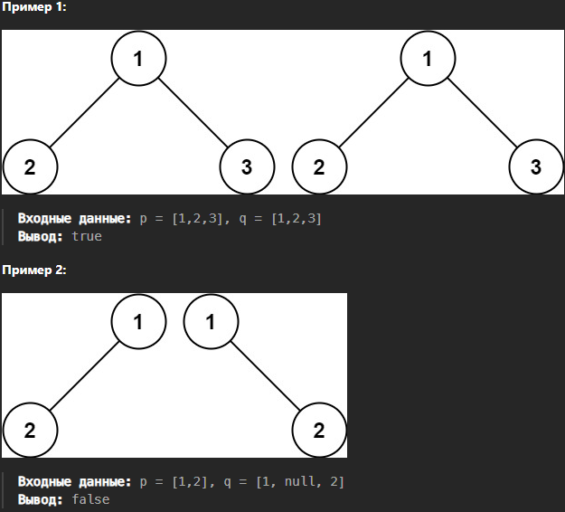

# [Same Tree](https://leetcode.com/problems/same-tree/)
## Задача
Учитывая корни двух двоичных деревьев `p` и `q`, напишите функцию, чтобы проверить, совпадают ли они или нет.

Два бинарных дерева считаются одинаковыми, если они структурно идентичны, а узлы имеют одинаковое значение.


## Идея
Используем стек для обхода дерева. При обходе в стек добавляем значение из обоих деревьев. При извлечение соответственно сразу 2 значения берем. Проверять на каждом шаге равенство, если не равно выйти со значением False. В конце функция должна вернуть True т.к. обошли все дерево и не нашли различий.

## Нюансы
- Внимание на порядок вставки и извлечение из стека. Если при обходе извлекаем сначала левые потом правый узлы, то класть надо сначала правый потом левый

## Решение
- Создать стек для обхода дерева
- Добавить корневые узлы деревьев в стек
- Запустить цикл
- Первым извлечением берем левый, вторым правый узлы из стека
- Пропускать итерацию, если оба узла None
- Различие: если только один из узлов None или их значения не равны
- Кладем в стек сначала узлы справа, сначала у правого, потом у левого узла
- Потом узлы слева, сначала у правого узла, потом у левого
- В конце вернуть True

```python
from collections import deque

# Definition for a binary tree node.
# class TreeNode:
#     def __init__(self, val=0, left=None, right=None):
#         self.val = val
#         self.left = left
#         self.right = right

class Solution:
    def isSameTree(self, p: Optional[TreeNode], q: Optional[TreeNode]) -> bool:
        stack = deque([p, q])
        
        while stack:
            left_node = stack.pop()
            right_node = stack.pop()

            if left_node is None and right_node is None:
                continue
            elif left_node is None or right_node is None:
                return False
            elif left_node.val != right_node.val:
                return False
            
            stack.append(right_node.right)
            stack.append(left_node.right)
            stack.append(right_node.left)
            stack.append(left_node.left)

        return True
```
Оценка по памяти `O((n log n) + (m log m))` храним узлы для обхода дерева

Оценка по времени `O(n)`, поиск в ширину по всему дереву
