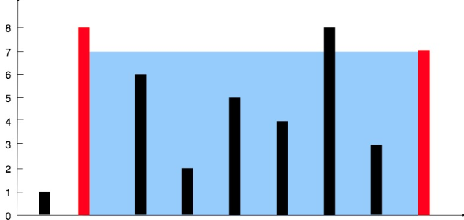

# [Container With Most Water](https://leetcode.com/problems/container-with-most-water/)
## Задача

Вам будет предоставлен массив целых чисел `height` длины `n`. Здесь `n` нарисованы вертикальные линии таким образом, что двумя конечными точками `ith` линии являются `(i, 0)` и `(i, height[i])`.

Найдите две линии, которые вместе с осью x образуют контейнер таким образом, чтобы в контейнере было больше всего воды.

Возвращайте _максимальное количество воды, которое может вместить емкость_.

**Обратите** внимание, что нельзя наклонять емкость.
```
Пример 1:
Ввод: height = [1,8,6,2,5,4,8,3,7]
Результат: 49 
Пояснение: Приведенные выше вертикальные линии представлены массивом [1,8,6,2,5,4,8,3,7]. В этом случае максимальное количество воды (синяя секция), которое может вместить контейнер, равно 49.

Пример 2:
Ввод: height = [1,1]
Выход: 1
```
## Идея
Использовать два указателя в начале и в конце. Между ними замерять объем, лучший результат сохранять. Указатель сдвигается тот, значение которого меньше и/или равно другому.
## Нюансы
## Решение
```python
class Solution:
    def maxArea(self, height: List[int]) -> int:
        l, r = 0, len(height) - 1
        best_size = 0

        while l < r:
            distance = r - l
            min_height = min(height[l], height[r])
            size = distance * min_height

            best_size = max(size, best_size)
            
            if height[l] <= height[r]:
                l += 1
            else:
                r -= 1

        return best_size
```
Оценка по памяти `O(1)`

Оценка по времени `O(n)`
